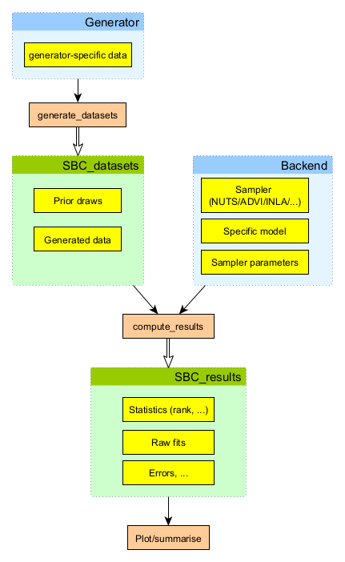

```{r setup, include=FALSE}
options(htmltools.dir.version = FALSE)
```

# Install SBC package

If you don't have it already:

```r
install.package("remotes")
```

```r
remotes::install_github("hyunjimoon/SBC")
```

---

# Overview of the SBC package

```{r, echo = FALSE, out.height="500px", out.width = "auto"}

```

---

# Code notes

We expect you to copy-paste code and store it in any way you prefer working with R either:

- Directly paste to console
- Create a script file and paste there
- Paste into chunks in a .Rmd file

Stan models should generally go into a specific Stan file (names given on the slides).

---

# Task 1/6 - a Stan model

A Stan model (save as `gamma.stan`)

```stan
```{r, echo = FALSE, comment = "", results ='asis'}
cat(readLines("gamma.stan"), sep = "\n")
```
```
---

# Task 2/6 - build a backend

Using `cmdstanr`:

```r
library(cmdstanr)
library(SBC)
model_gamma <- cmdstan_model("gamma.stan")

backend_gamma <- SBC_backend_cmdstan_sample(
    model_gamma, # <- model is first argument
    # additional args passed to to model$sample() directly 
    iter_warmup = 500, iter_sampling = 1000, chains = 2)
```

Using `rstan`:

```r
library(rstan)
library(SBC)
model_gamma <- stan_model("gamma.stan")

backend_gamma <- SBC_backend_rstan_sample(
    model_gamma, # <- model is first argument
    # additional args passed to sampling directly 
    iter = 1500, warmup = 1000, chains = 2)

```

---

# Task 3/6 - generating a single dataset

In a format the SBC package undertands...

```r
# N - the number of observed datapoints
single_dataset_gamma <- function(N) {
  shape <- rlnorm(n = 1, meanlog =  0, sdlog = 1)
  scale <- rlnorm(n = 1, meanlog = 0, sdlog = 1.5)
  y <- rgamma(N, shape = shape, scale = scale)
  
  list(
    # True, unobserved
    parameters = list(
      shape = shape,
      scale = scale),
    # Observed data, passed directly to Stan
    generated = list(
      N = N,
      y = y)
  )
}

```

Now calling `single_dataset_gamma(<insert number here>)` creates a single dataset.
Try it! Do you understand the output?

---

# Question 1/2

Do you see a mismatch between the way `single_dataset_gamma` creates data match the Stan model?

If yes, write down your guess!

Don't spend too much time looking for it, if you don't see it - SBC is going to 
help us!

---

# Task 4/6 - generating multiple datasets

Here we build a "generator" object that can be used to create multiple datasets
and combine them together.

```r
generator_gamma <- SBC_generator_function(
  # Passing single_dataset_gamma as a parameter, 
  # not calling it
  single_dataset_gamma, 
  # Additional arguments are passed to the function
  # Here we only use N
  N = 40)
  
datasets_gamma <- generate_datasets(
  generator_gamma, 
  n_datasets = 10)
```

It is good practice to start with just a few datasets 
to quickly check that the model roughly works without wasting too much time.

For this problem 10 datasets should be more than enough.

---

# Task 5/6 - run SBC

```r
results_gamma <- compute_results(
                   datasets_gamma, backend_gamma)
```

You may get a warning similar to:

```
 - 10 (100%) fits had some steps rejected. 
   Maximum number of rejections was 5.
```

Here, we can safely ignore it (there were numerical issues limited to early warmup), 
but in general inspecting the results further would be warranted.


---

# Task 6/6 - plot results

You can plot the results in various formats:

```r
plot_rank_hist(results_gamma, bins = 10)
plot_ecdf(results_gamma)
plot_ecdf_diff(results_gamma)
```

# Question 2/2

What do the results tell you? 
What is the problem with the model?

_Note: there is a low probability you'll get unlucky and your plots will look completely OK.
If that happens, just rerun the dataset generation step and the SBC step. _

No idea what the problem is? That's OK. There's a hint on the next slide!

---

# Question 2/2 - Hint 1

Compare the intro to [Wikipedia on Gamma distribution](https://en.wikipedia.org/wiki/Gamma_distribution)
with [Stan manual on Gamma distribution](https://mc-stan.org/docs/functions-reference/gamma-distribution.html)

Still no idea? Don't worry, this stuff is hard. One more hint on the next slide.

---

# Question 2/2 - Hint 2

Gamma distribution has multiple parametrizations which are we using?

---

# Bonus Task 1

Create a copy of `gamma.stan` called `gamma2.stan`. 
Modify it to match the simulator. (don't know how? there's a hint on the next slide)

Create a new backend (`backend_gamma2`) with the modified model and rerun SBC with the same datasets:

```r
results_gamma2 <- compute_results(
                   datasets_gamma, backend_gamma2)

```
---

# Bonus Task 1 - Hint

Transform the parameter the model currently uses into one needed for Stan's parametrization
in your `model` or `transformed parameters` block. You don't need to change anything else.

---

# Bonus Task 2

You can inspect a detailed report of the "true" simulated values, their rank and z-score
in the posterior and summaries of the posterior distribution via `results_gamma$stats`.

Would the z-score column let you figure out the problem more easily than the plots?
Would inspecting the statistics let you see the failure with fewer datasets/fits than the plots?

---

# Bonus Task 3

Play with `N` (the number of datapoints) when creating `generator_gamma`
and `n_datasets` (the number of datasets/fits) when creating `datasets_gamma`.

Which values let you reliably detect the problem? Which values can keep the problem hidden?

