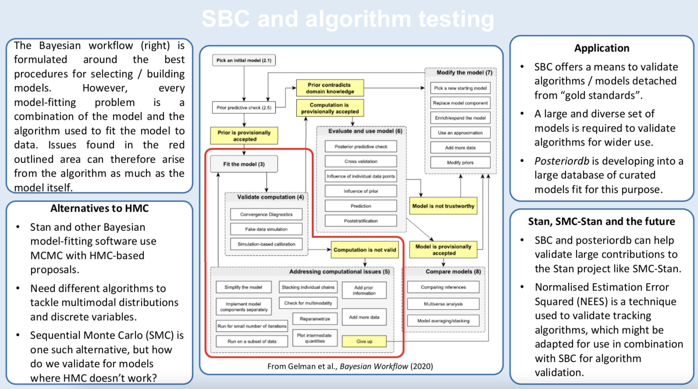

## Preparing for the tutorial

You will need to be able to compile and run Stan models from R/Rstudio via either `rstan` or `cmdstanr`. If you are not already an R user, we recommend using RStudio + `cmdstanr`. A good guide to install RStudio is at https://moderndive.netlify.app/1-getting-started.html and installing cmdstanr is described at
https://mc-stan.org/cmdstanr/articles/cmdstanr.html 
If you encounter any problems during installation, please ask for help at https://discourse.mc-stan.org/

To let you work quickly through the exercises, we recommend running our setup script that
makes sure you have installed all you need and precompiles all models used in the exercises. You can run it via

```r
source("https://raw.githubusercontent.com/martinmodrak/tutorial-sbc-stanconnect2021/main/setup_script.R")
```

If you don't want to use the setup script you'll need to at least install the new SBC package. 
To install it, you'll need the remotes package first:

```r
install.package("remotes")
```

Then you can install SBC via

```r
remotes::install_github("hyunjimoon/SBC")
```


## Slides for the tutorial

- [Introduction to SBC](sbc_intro.html)
- [Introduction to SBC - short version](sbc_intro_short.html) <- will be used at the live event, because Andrew Gelman will cover the context and basics.
- [Exercise 1 - SBC theory](exercise_1_theory.html)
- [Exercise 2 - Your first SBC](exercise_2_first_SBC.html)
- [Exercise 3 - Linear regression](exercise_3_regression.html)
- [Concluding remarks](conclusion.html)

## Getting help during the live tutorial

If you are having technical problems running Stan models, visit on of the "Resolving Stan problems" 
tables in the social lounge.

Problems with tutorial tasks/questions should first be consulted with your colleagues at your table.
If that doesn't work for you for any reason, send a private message to one of the organizers (Martin Modrák, Hyunji Moon, 
Shinyoung Kim) - you need to click "People" in the right sidebar, find any of us and click "Send message" 

## Discuss your results

If you want to discuss the results after the tutorial (e.g. wonder if you got the bonus questions right), feel welcome to ask at [a dedicated thread on Stan forums](https://discourse.mc-stan.org/t/sbc-stanconnect-tutorial-discussion-thread/24176).

## Poster on SBC & algorithms

Phil Clemson made a neat poster on using SBC for testing _algorithms_ once we have
a simulator and model we trust (unlike the tutorial which focuses on testing a model when we have an algorithm and a simulator we trust).



## Further reading on SBC and model development

- [Validating Bayesian Inference Algorithms with Simulation-Based Calibration](https://arxiv.org/pdf/1804.06788.pdf) Talts, Betancourt, Simpson, Vehtari, Gelman, 2018
- [Graphical Test for Discrete Uniformity and its Applications in Goodness of Fit Evaluation and Multiple Sample Comparison](https://arxiv.org/abs/2103.10522) Säilynoja, Bürkner, Vehtari, 2021
- [Bayesian Workflow](https://arxiv.org/abs/2011.01808), Gelman et al., 2020
- [Toward a principled Bayesian workflow in cognitive science](https://psycnet.apa.org/record/2020-43606-001) Schad, Betancourt, Vasishth, 2021


This work was supported by ELIXIR CZ research infrastructure project (MEYS Grant No: LM2018131) including access to computing and storage facilities.
